# GeekMagic Display for Home Assistant

[](https://github.com/hacs/integration)

A Home Assistant custom integration for GeekMagic displays (SmallTV Pro and similar ESP8266-based devices).

## Dashboard Samples

<p align="center">
  
  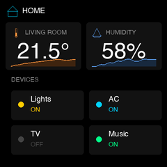
  
  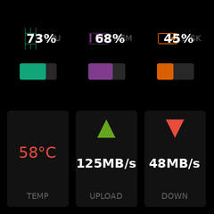
</p>

<p align="center">
  
  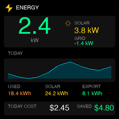
  
  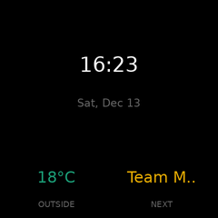
</p>

<p align="center">
  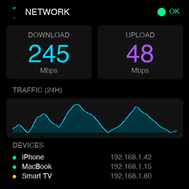
  
  
  
</p>

## Features

- **12 widget types**: Clock, entity, media, chart, text, gauge, progress, weather, status, camera, and more
- **5 layout options**: Grid (2x2, 2x3), hero, split, three-column
- **Entity-based configuration**: Configure via Home Assistant entities (WLED-style)
- **Multi-screen support**: Up to 10 screens with auto-cycling
- **Pure Python rendering**: Uses Pillow for image generation (no browser required)
- **Configurable refresh**: Updates every 5-300 seconds

## Installation

### HACS (Recommended)

1. Open HACS in Home Assistant
2. Click "Custom repositories"
3. Add this repository URL
4. Install "GeekMagic Display"
5. Restart Home Assistant

### Manual

1. Copy `custom_components/geekmagic` to your Home Assistant's `custom_components` folder
2. Restart Home Assistant

## Configuration

1. Go to **Settings** → **Devices & Services**
2. Click **Add Integration**
3. Search for "GeekMagic"
4. Enter your device's IP address

### Initial Setup

After adding the integration, your device will display a welcome screen with live data until you configure a dashboard:

<p align="center">
  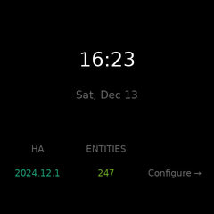
</p>

The welcome screen shows:
- **Current time and date** - Updates every refresh interval
- **Home Assistant version** - Your HA instance version
- **Entity count** - Total entities in your system
- **Configure hint** - Reminder to set up your dashboard

---

## Entity-Based Configuration (WLED-Style)

GeekMagic uses **entity-based configuration** similar to WLED. Instead of navigating through settings menus, you configure your display directly through Home Assistant entities on the device page.

### Device Entities

After setup, your device exposes these configuration entities:

#### Device Controls
| Entity | Type | Description |
|--------|------|-------------|
| `number.xxx_brightness` | Number | Display brightness (0-100) |
| `number.xxx_refresh_interval` | Number | Update interval in seconds (5-300) |
| `number.xxx_screen_cycle_interval` | Number | Auto-cycle screens (0=disabled, 5-300s) |
| `number.xxx_screen_count` | Number | Number of screens (1-10) |
| `select.xxx_current_screen` | Select | Active screen selector |

#### Action Buttons
| Entity | Type | Description |
|--------|------|-------------|
| `button.xxx_refresh_now` | Button | Force immediate display update |
| `button.xxx_next_screen` | Button | Switch to next screen |
| `button.xxx_previous_screen` | Button | Switch to previous screen |

#### Diagnostic Sensors
| Entity | Type | Description |
|--------|------|-------------|
| `sensor.xxx_status` | Sensor | Connection status (connected/disconnected) |
| `sensor.xxx_last_update` | Sensor | Timestamp of last successful update |
| `sensor.xxx_current_screen_name` | Sensor | Name of the currently active screen |

### Per-Screen Entities

Each screen has its own configuration entities:

| Entity | Type | Description |
|--------|------|-------------|
| `text.xxx_screen_N_name` | Text | Screen name |
| `select.xxx_screen_N_layout` | Select | Layout type (grid, hero, split, etc.) |

### Per-Slot Entities

Each slot in a layout has widget configuration:

| Entity | Type | Description |
|--------|------|-------------|
| `select.xxx_screen_N_slot_M_widget` | Select | Widget type |
| `text.xxx_screen_N_slot_M_entity` | Text | Home Assistant entity ID to display |
| `text.xxx_screen_N_slot_M_label` | Text | Custom label (optional) |

### Widget Option Switches

Boolean options for each widget type appear as switches:

| Widget | Options |
|--------|---------|
| Clock | `show_seconds`, `show_date` |
| Entity | `show_name`, `show_unit`, `show_panel` |
| Chart | `show_value`, `show_range` |
| Media | `show_artist`, `show_album`, `show_progress` |
| Weather | `show_forecast`, `show_humidity`, `show_wind` |
| Progress | `show_target` |
| Camera | `show_label` |

---

## Configuration Examples

### Weather Dashboard (Hero Layout)

A weather-focused display with forecast and indoor conditions.

```yaml
# Screen: Hero layout (4 slots)
# Slot 0 (hero): Weather widget with forecast
# Slot 1-3 (footer): Indoor temp, humidity, outdoor temp

# Configure via entities:
select.geekmagic_display_screen_1_layout: "Hero (4 slots)"
select.geekmagic_display_screen_1_slot_1_widget: "Weather"
text.geekmagic_display_screen_1_slot_1_entity: "weather.home"
select.geekmagic_display_screen_1_slot_2_widget: "Entity"
text.geekmagic_display_screen_1_slot_2_entity: "sensor.living_room_temperature"
select.geekmagic_display_screen_1_slot_3_widget: "Entity"
text.geekmagic_display_screen_1_slot_3_entity: "sensor.living_room_humidity"
select.geekmagic_display_screen_1_slot_4_widget: "Entity"
text.geekmagic_display_screen_1_slot_4_entity: "sensor.outdoor_temperature"
```

### System Monitor (Grid 2x2)

Monitor your server or Home Assistant host.

```yaml
# Screen: Grid 2x2 layout (4 slots)
# 4 gauge widgets showing CPU, Memory, Disk, Network

select.geekmagic_display_screen_1_layout: "Grid 2x2 (4 slots)"
select.geekmagic_display_screen_1_slot_1_widget: "Gauge"
text.geekmagic_display_screen_1_slot_1_entity: "sensor.processor_use"
select.geekmagic_display_screen_1_slot_2_widget: "Gauge"
text.geekmagic_display_screen_1_slot_2_entity: "sensor.memory_use_percent"
select.geekmagic_display_screen_1_slot_3_widget: "Gauge"
text.geekmagic_display_screen_1_slot_3_entity: "sensor.disk_use_percent"
select.geekmagic_display_screen_1_slot_4_widget: "Chart"
text.geekmagic_display_screen_1_slot_4_entity: "sensor.network_throughput_in"
```

### Media Player (Hero Layout)

Display now playing with album art.

```yaml
# Screen: Hero layout
# Slot 0 (hero): Media player with album art
# Slot 1-3: Additional info

select.geekmagic_display_screen_1_layout: "Hero (4 slots)"
select.geekmagic_display_screen_1_slot_1_widget: "Media Player"
text.geekmagic_display_screen_1_slot_1_entity: "media_player.spotify"
select.geekmagic_display_screen_1_slot_2_widget: "Text"
select.geekmagic_display_screen_1_slot_3_widget: "Entity"
text.geekmagic_display_screen_1_slot_3_entity: "sensor.living_room_temperature"
select.geekmagic_display_screen_1_slot_4_widget: "Clock"
```

### Smart Home Overview (Grid 2x3)

6 entity slots for a compact home status view.

```yaml
# Screen: Grid 2x3 layout (6 slots)
# Mix of temperature, humidity, and status widgets

select.geekmagic_display_screen_1_layout: "Grid 2x3 (6 slots)"
select.geekmagic_display_screen_1_slot_1_widget: "Entity"
text.geekmagic_display_screen_1_slot_1_entity: "sensor.living_room_temperature"
select.geekmagic_display_screen_1_slot_2_widget: "Entity"
text.geekmagic_display_screen_1_slot_2_entity: "sensor.living_room_humidity"
select.geekmagic_display_screen_1_slot_3_widget: "Status"
text.geekmagic_display_screen_1_slot_3_entity: "binary_sensor.front_door"
select.geekmagic_display_screen_1_slot_4_widget: "Status"
text.geekmagic_display_screen_1_slot_4_entity: "binary_sensor.motion_sensor"
select.geekmagic_display_screen_1_slot_5_widget: "Entity"
text.geekmagic_display_screen_1_slot_5_entity: "light.living_room"
select.geekmagic_display_screen_1_slot_6_widget: "Status"
text.geekmagic_display_screen_1_slot_6_entity: "person.john"
```

### Clock & Temperature (Split Layout)

Large clock with chart on the side.

```yaml
# Screen: Split layout (2 slots)
# Slot 0: Large clock
# Slot 1: Temperature chart

select.geekmagic_display_screen_1_layout: "Split (2 slots)"
select.geekmagic_display_screen_1_slot_1_widget: "Clock"
select.geekmagic_display_screen_1_slot_2_widget: "Chart"
text.geekmagic_display_screen_1_slot_2_entity: "sensor.outdoor_temperature"
```

### Example Automations

```yaml
# Cycle screens based on time of day
automation:
  - alias: "Morning dashboard"
    trigger:
      - platform: time
        at: "07:00:00"
    action:
      - service: select.select_option
        target:
          entity_id: select.geekmagic_display_current_screen
        data:
          option: "Weather"

  - alias: "Evening dashboard"
    trigger:
      - platform: time
        at: "18:00:00"
    action:
      - service: select.select_option
        target:
          entity_id: select.geekmagic_display_current_screen
        data:
          option: "Media"
```

```yaml
# Show security camera when motion detected
automation:
  - alias: "Show camera on motion"
    trigger:
      - platform: state
        entity_id: binary_sensor.front_door_motion
        to: "on"
    action:
      - service: select.select_option
        target:
          entity_id: select.geekmagic_display_screen_1_slot_1_widget
        data:
          option: "Camera"
      - service: text.set_value
        target:
          entity_id: text.geekmagic_display_screen_1_slot_1_entity
        data:
          value: "camera.front_door"
```

---

## Widgets

### Available Widget Types

| Widget | Type | Description |
|--------|------|-------------|
| Camera | `camera` | Camera snapshot display |
| Clock | `clock` | Current time and date |
| Entity | `entity` | Any Home Assistant entity value |
| Media | `media` | Now playing from media player |
| Chart | `chart` | Sparkline chart from entity history |
| Text | `text` | Static or dynamic text |
| Gauge | `gauge` | Progress bar, ring, or arc gauge |
| Progress | `progress` | Goal tracking with progress bar |
| Multi-Progress | `multi_progress` | Multiple progress items |
| Weather | `weather` | Weather with forecast |
| Status | `status` | Binary sensor indicator |
| Status List | `status_list` | Multiple status indicators |

### Widget Examples

#### Camera

Displays a camera entity snapshot.

| Option | Type | Default | Description |
|--------|------|---------|-------------|
| `show_label` | bool | `false` | Show camera name label |
| `fit` | string | `"contain"` | `"contain"` (preserve aspect) or `"cover"` (fill) |

#### Clock
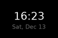

Displays current time and date.

| Option | Type | Default | Description |
|--------|------|---------|-------------|
| `show_date` | bool | `true` | Show date below time |
| `show_seconds` | bool | `false` | Include seconds |
| `time_format` | string | `"24h"` | `"24h"` or `"12h"` |

#### Entity


Displays any Home Assistant entity state.

| Option | Type | Default | Description |
|--------|------|---------|-------------|
| `show_name` | bool | `true` | Show entity name |
| `show_unit` | bool | `true` | Show unit of measurement |
| `icon` | string | - | Icon name (e.g., `"drop"`, `"bolt"`) |
| `show_panel` | bool | `false` | Draw panel background |

#### Media Player


Displays now-playing information from a media player.

| Option | Type | Default | Description |
|--------|------|---------|-------------|
| `show_artist` | bool | `true` | Show artist name |
| `show_album` | bool | `false` | Show album name |
| `show_progress` | bool | `true` | Show progress bar |

#### Chart


Displays sparkline chart from entity history.

| Option | Type | Default | Description |
|--------|------|---------|-------------|
| `hours` | int | `24` | Hours of history |
| `show_value` | bool | `true` | Show current value |
| `show_range` | bool | `true` | Show min/max range |

#### Text


Displays static or dynamic text.

| Option | Type | Default | Description |
|--------|------|---------|-------------|
| `text` | string | - | Static text to display |
| `size` | string | `"regular"` | `"small"`, `"regular"`, `"large"`, `"xlarge"` |
| `align` | string | `"center"` | `"left"`, `"center"`, `"right"` |

#### Gauge


Displays value as bar, ring, or arc gauge.

| Option | Type | Default | Description |
|--------|------|---------|-------------|
| `style` | string | `"bar"` | `"bar"`, `"ring"`, or `"arc"` |
| `min` | float | `0` | Minimum value |
| `max` | float | `100` | Maximum value |
| `icon` | string | - | Icon name |
| `unit` | string | - | Unit of measurement |
| `attribute` | string | - | Read from entity attribute |

#### Progress


Displays progress toward a goal.

| Option | Type | Default | Description |
|--------|------|---------|-------------|
| `target` | float | `100` | Goal value |
| `unit` | string | - | Unit of measurement |
| `show_target` | bool | `true` | Show "current/target" |
| `icon` | string | - | Icon name |

#### Multi-Progress


Displays multiple progress items (fitness tracking style).

| Option | Type | Default | Description |
|--------|------|---------|-------------|
| `title` | string | - | Widget title |
| `items` | list | - | List of progress configs |

Each item in `items`:
```yaml
- entity_id: sensor.calories
  label: "Move"
  target: 800
  color: [255, 0, 0]
  icon: "flame"
  unit: "cal"
```

#### Weather


Displays weather with forecast.

| Option | Type | Default | Description |
|--------|------|---------|-------------|
| `show_forecast` | bool | `true` | Show forecast days |
| `forecast_days` | int | `3` | Number of forecast days |
| `show_humidity` | bool | `true` | Show humidity |
| `show_wind` | bool | `false` | Show wind speed |

#### Status


Displays binary sensor with colored indicator.

| Option | Type | Default | Description |
|--------|------|---------|-------------|
| `on_color` | tuple | lime | Color when on |
| `off_color` | tuple | red | Color when off |
| `on_text` | string | `"ON"` | Text when on |
| `off_text` | string | `"OFF"` | Text when off |
| `icon` | string | - | Icon name |

#### Status List


Displays list of binary sensors.

| Option | Type | Default | Description |
|--------|------|---------|-------------|
| `title` | string | - | List title |
| `entities` | list | - | List of entity IDs or (id, label) tuples |
| `on_color` | tuple | lime | Color when on |
| `off_color` | tuple | red | Color when off |

---

## Layouts

### Available Layout Types

| Layout | Type | Slots | Description |
|--------|------|-------|-------------|
| Grid 2x2 | `grid_2x2` | 4 | 2x2 grid of equal widgets |
| Grid 2x3 | `grid_2x3` | 6 | 2 rows, 3 columns |
| Hero | `hero` | 4 | Large hero + 3 footer widgets |
| Split | `split` | 2 | Left/right or top/bottom panels |
| Three Column | `three_column` | 3 | 3 vertical columns |

### Layout Examples

#### Grid 2x2
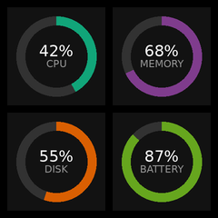

4 equal slots in a 2x2 arrangement. Each slot is ~112x112px.

```
+-------+-------+
|   0   |   1   |
+-------+-------+
|   2   |   3   |
+-------+-------+
```

**Best for**: 4 medium widgets (gauges, entities)

#### Grid 2x3
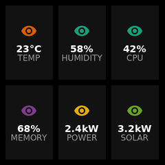

6 slots in 2 rows, 3 columns. Each slot is ~75x112px.

```
+-----+-----+-----+
|  0  |  1  |  2  |
+-----+-----+-----+
|  3  |  4  |  5  |
+-----+-----+-----+
```

**Best for**: 6 entity values, compact dashboard

#### Hero Layout
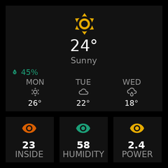

Large hero slot (70% height) + 3 footer widgets.

```
+-------------------+
|                   |
|    HERO (0)       |
|                   |
+-----+------+------+
|  1  |   2  |   3  |
+-----+------+------+
```

| Option | Type | Default | Description |
|--------|------|---------|-------------|
| `footer_slots` | int | `3` | Number of footer widgets |
| `hero_ratio` | float | `0.7` | Hero height ratio (0.5-0.8) |

**Best for**: Weather + stats, clock + info, media player

#### Split
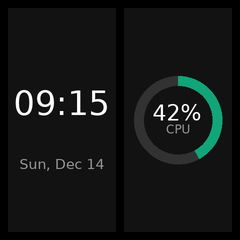

Two panels (left/right or top/bottom).

```
Vertical (default):     Horizontal:
+----------+----------+ +---------------------+
|          |          | |         0           |
|    0     |    1     | +---------------------+
|          |          | |         1           |
+----------+----------+ +---------------------+
```

**Best for**: Clock + chart, media + status, large widget pairs

#### Three Column
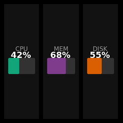

Three vertical columns with customizable widths.

```
+------+------+------+
|      |      |      |
|  0   |  1   |  2   |
|      |      |      |
+------+------+------+
```

| Option | Type | Default | Description |
|--------|------|---------|-------------|
| `ratios` | tuple | `(0.33, 0.34, 0.33)` | Column width ratios |

**Best for**: 3 gauges, 3 status lists, comparison view

---

## Services

| Service | Description |
|---------|-------------|
| `geekmagic.refresh` | Force immediate display update |
| `geekmagic.brightness` | Set display brightness (0-100) |
| `geekmagic.set_screen` | Switch to a specific screen by index |
| `geekmagic.next_screen` | Switch to the next screen |
| `geekmagic.previous_screen` | Switch to the previous screen |

> **Tip**: For most use cases, you can use the entity-based controls instead of services. For example, use the `button.xxx_next_screen` entity or `select.xxx_current_screen` entity for screen navigation.

## Device Compatibility

Tested with:
- GeekMagic SmallTV Pro (240x240, ESP8266)

Should work with any GeekMagic device that supports the `/doUpload` HTTP API.

## Development

```bash
# Install dependencies
uv sync

# Run tests
uv run pytest

# Lint and type check
uv run ruff check .
uv run ty check

# Run all checks (pre-commit)
uv run pre-commit run --all-files

# Generate sample images
uv run python scripts/generate_samples.py
uv run python scripts/generate_widget_samples.py
uv run python scripts/generate_layout_samples.py
```

## License

MIT
